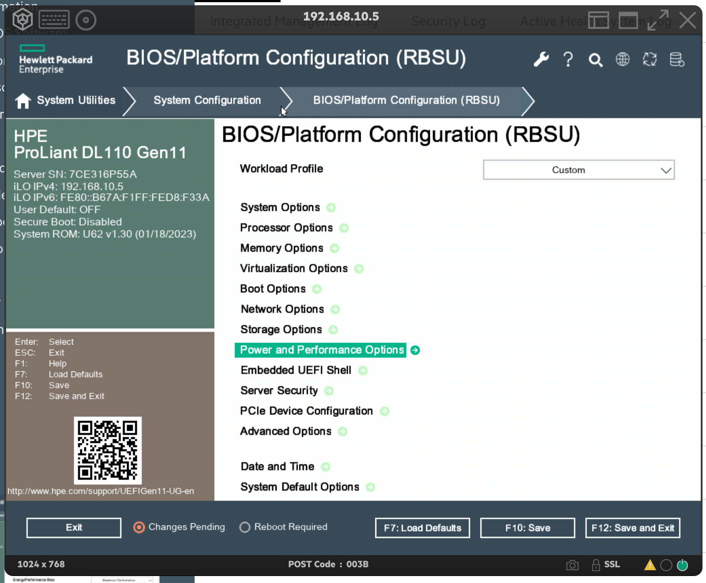
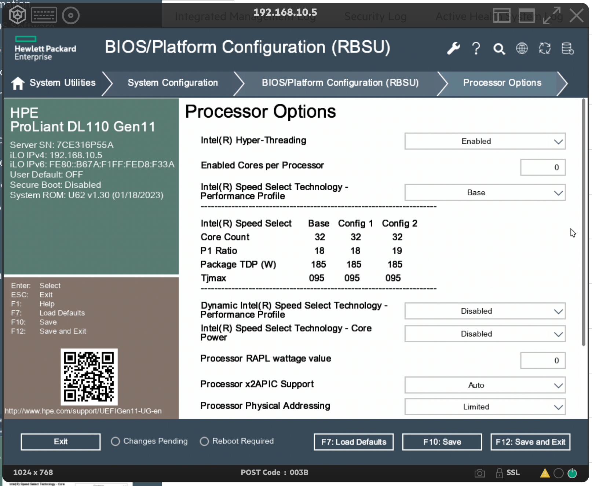
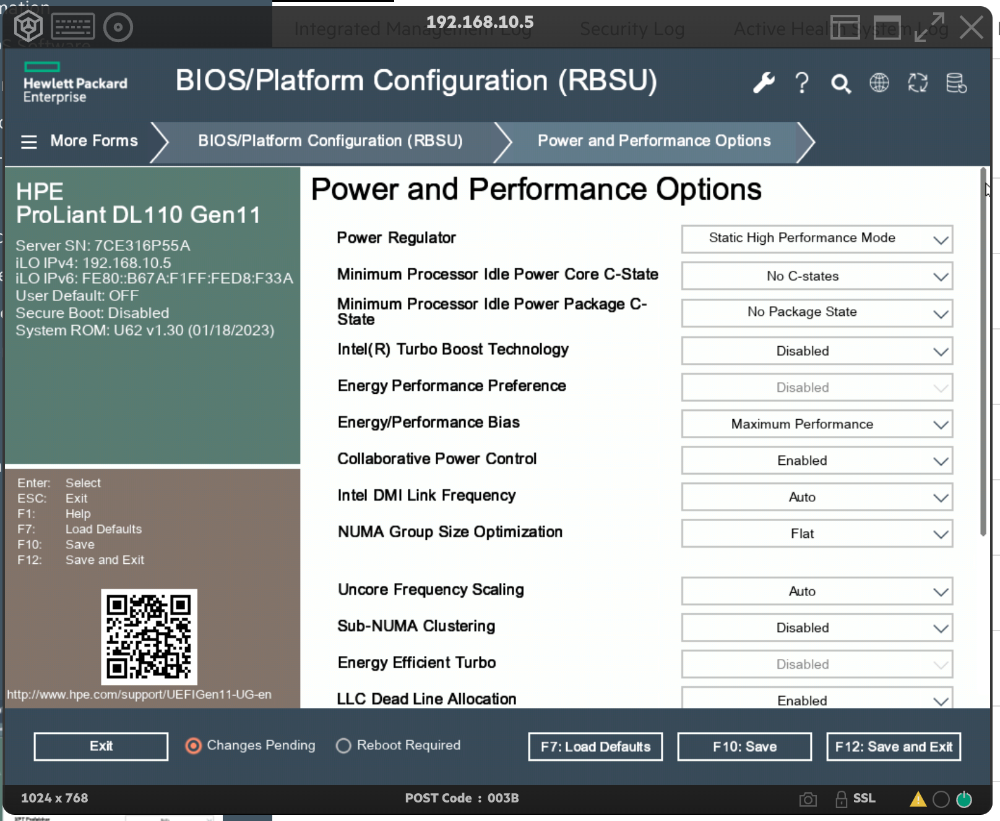
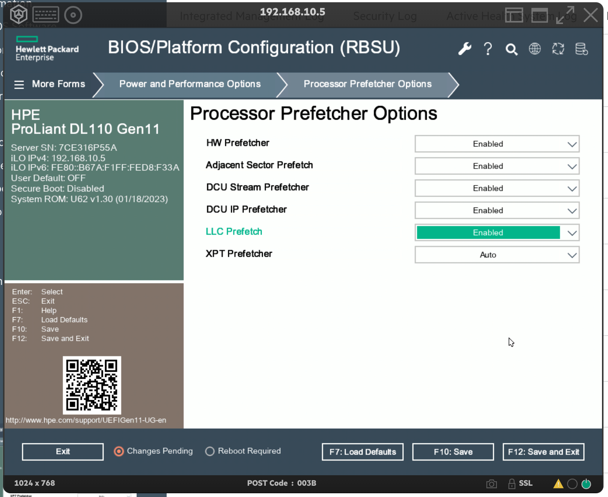
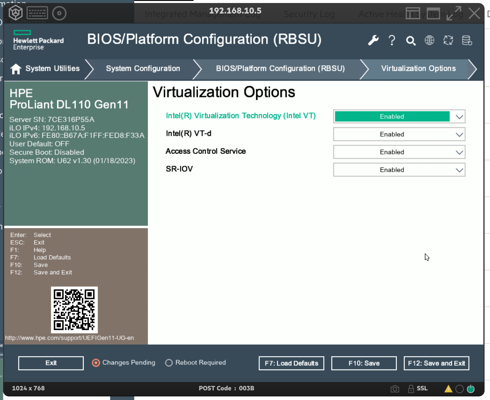
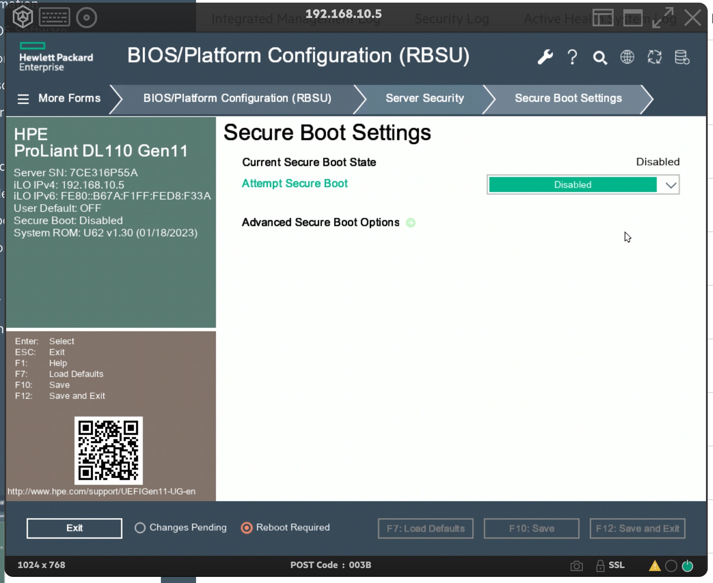

## 1. BIOS settings

The BIOS settings for the HPE DL110 Worker nodes must be configured as per the below reference table -

| Parameter         | Configuration |
|-------------------|---------------|
| Clock Frequency   | Fixed         |
| C-States          | Disabled      |
| Turbo Power boost | Disabled      |
| Hyper Threading   | Enabled       |
| Virtualization    | Disabled      |
| LLC Prefetch      | Enabled       |
| SR-IOV            | Enabled       |

### 1.1. Processor Options

* Change Workload Profile to `Custom`

{:height="600px" width="600px"}

### 1.2. Ensure Intel Hyper Threading is enabled under - RBSU -> Processor Options

{:height="600px" width="600px"}

### 1.3. Go to RBSU -> Power and Performance Options and change the following -

* Change Power Regulator to Static High Performance Mode
* Change Idle Power Core C-State to No C-states
* Change Idle Power Power Package C-State to No Package State
* Change Intel Turbo Boost to Disabled
* Change Energy/Performance Bias to Maximum Performance

{:height="600px" width="600px"}

### 1.4. Navigate to RBSU -> Power and Performance Options -> Processor Prefetch Options

* Make sure LLC Prefetch is Enabled

{:height="600px" width="600px"}

### 1.5. Navigate to RBSU -> Virtualization Options

* Make sure Intel-VT is Enabled
* Make sure SR-IOV is Enabled

{:height="600px" width="600px"}

### 1.6. Navigate to RBSU -> Server Security

* Make sure Secure Boot is Disabled

{:height="600px" width="600px"}
